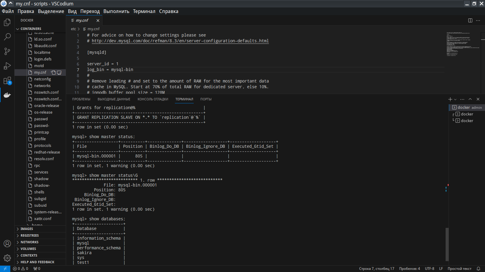
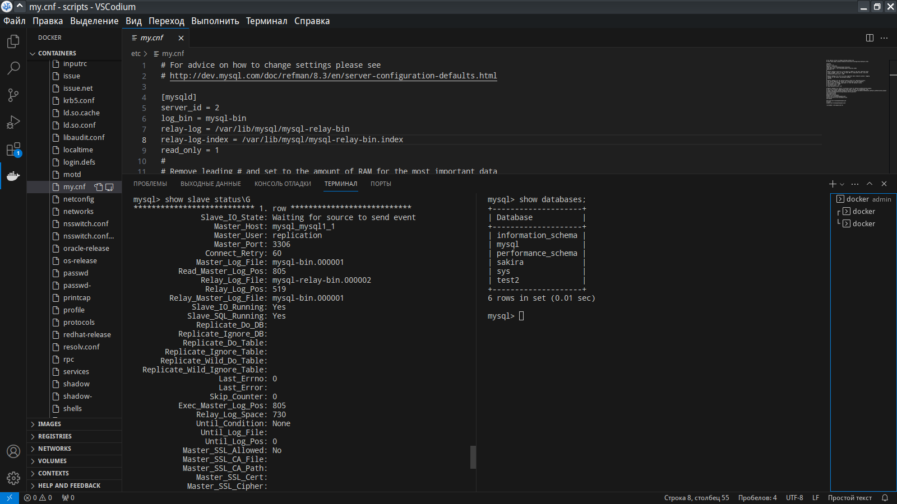

# Домашнее задание к занятию «Репликация и масштабирование. Часть 1»
## Слынько Дмитрий Юриевич

### Задание 1

На лекции рассматривались режимы репликации master-slave, master-master, опишите их различия.

*Ответить в свободной форме.*

### Решениe 1

В master-master репликации все серверы равноправны, так как каждый сервер сохраняет часть данных и обменивается ими между собой, в то время как в master-slave репликации только один сервер записывает информацию, в то время как остальные серверы предназначены только для чтения.

### Задание 2

Выполните конфигурацию master-slave репликации, примером можно пользоваться из лекции.

*Приложите скриншоты конфигурации, выполнения работы: состояния и режимы работы серверов.*

### Решение 2

