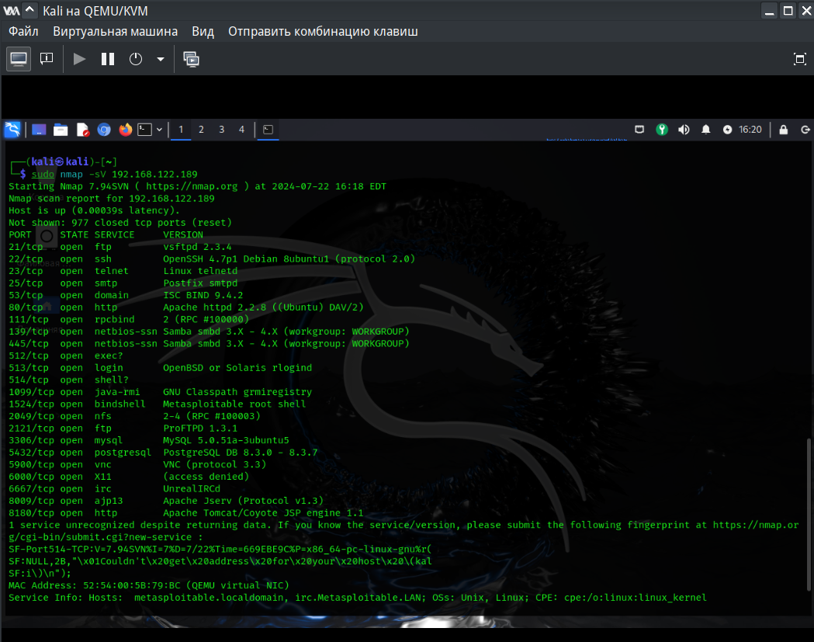

# Домашнее задание к занятию «Уязвимости и атаки на информационные системы»
## Слынько Дмитрий Юриевич

### Задание 1

Скачайте и установите виртуальную машину Metasploitable: https://sourceforge.net/projects/metasploitable/.

Это типовая ОС для экспериментов в области информационной безопасности, с которой следует начать при анализе уязвимостей.

Просканируйте эту виртуальную машину, используя **nmap**.

Попробуйте найти уязвимости, которым подвержена эта виртуальная машина.

Сами уязвимости можно поискать на сайте https://www.exploit-db.com/.

Для этого нужно в поиске ввести название сетевой службы, обнаруженной на атакуемой машине, и выбрать подходящие по версии уязвимости.

Ответьте на следующие вопросы:

- Какие сетевые службы в ней разрешены?
- Какие уязвимости были вами обнаружены? (список со ссылками: достаточно трёх уязвимостей)
  
*Приведите ответ в свободной форме.*  

### Решение 1

Уязвимости:

<a href="https://www.exploit-db.com/exploits/40962">OpenSSH < 7.4</a>

<a href="https://www.exploit-db.com/exploits/17491">vsftpd 2.3.4</a>

<a href="https://www.exploit-db.com/exploits/30020">MySQL 5.0.x</a>

### Задание 2

Проведите сканирование Metasploitable в режимах SYN, FIN, Xmas, UDP.

Запишите сеансы сканирования в Wireshark.

Ответьте на следующие вопросы:

- Чем отличаются эти режимы сканирования с точки зрения сетевого трафика?
- Как отвечает сервер?

*Приведите ответ в свободной форме.*

### Решение 2

SYN -sS (Посылаем SYN пакет, как если бы хотели установить реальное соединение и ждем. Ответы SYN/ACK указывают на то, что порт прослушивается (открыт), а RST (сброс) на то, что не прослушивается. Если после нескольких запросов не приходит никакого ответа, то порт помечается как фильтруемый. Порт также помечается как фильтруемый, если в ответ приходит ICMP сообщение об ошибке недостижимости)

FIN -sF (Вместо того, чтобы использовать raw пакеты, как это происходит при большинстве других типов сканирования, Nmap "просит" операционную систему установить соединение с целевой машиной по указанному порту путем системного вызова connect.)

Xmas -sX (Когда сканируется система отвечающая требованиям RFC, любой пакет, не содержащий установленного бита SYN, RST или ACK, повлечет за собой отправку RST в ответ в случае, если порт закрыт, или не повлечет никакого ответа, если порт открыт. Т.к. ни один из этих битов не установлен, то любая комбинация трех оставшихся (FIN, PSH и URG) будет являться правильной. При Xmas устанавливаются FIN, PSH и URG флаги. Если в ответ приходит RST пакет, то порт считается закрытым, отсутствие ответа означает, что порт открыт|фильтруется. Порт помечается как фильтруется, если в ответ приходит ICMP ошибка о недостижимости (тип 3, код 1, 2, 3, 9, 10 или 13).)

UDP -sU (UDP сканирование работает путем посылки пустого (без данных) UDP заголовка на каждый целевой порт. Если в ответ приходит ICMP ошибка о недостижимости порта (тип 3, код 3), значит порт закрыт. Другие ICMP ошибки недостижимости (тип 3, коды 1, 2, 9, 10 или 13) указывают на то, что порт фильтруется. Иногда, служба будет отвечать UDP пакетом, указывая на то, что порт открыт. Если после нескольких попыток не было получено никакого ответа, то порт классифицируется как открыт|фильтруется. Это означает, что порт может быть открыт, или, возможно, пакетный фильтр блокирует его.)