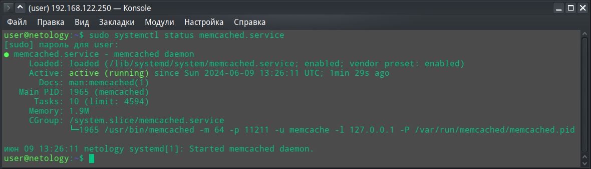
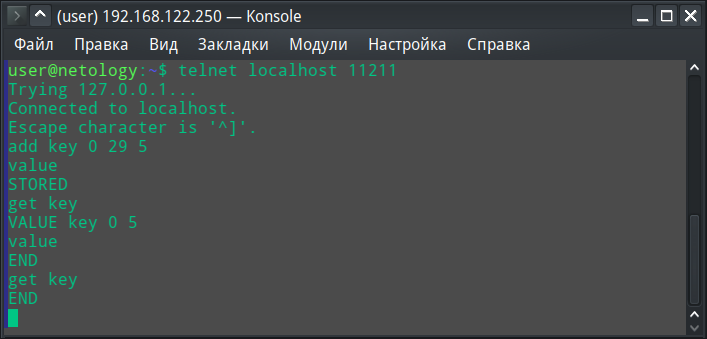
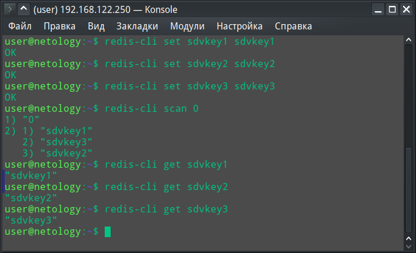

# Домашнее задание к занятию «Кеширование Redis/memcached»

## Слынько Дмитрий Юриевич

### Задание 1. Кеширование 

Приведите примеры проблем, которые может решить кеширование. 

*Приведите ответ в свободной форме.*

### Решение 1

Одной из наиболее распространенных задач является повышение производительности и ускорение получения данных, которые обычно решаются с помощью кэширования. Конечному пользователю это дает прирост скорости загрузки веб-страниц или более быстрые ответы приложения, чем это было бы возможно без использования кэширования.

Использование кэширования позволяет сэкономить ресурсы, так как получение данных из кэша стоит дешевле, чем выполнение запросов к базе данных или другим хранилищам.

Еще одно преимущество кэширования заключается в возможности справляться с пиковыми нагрузками, которые могут исчерпать ресурсы сервера СУБД или других систем, если не использовать кэширование.

### Задание 2. Memcached

Установите и запустите memcached.

*Приведите скриншот systemctl status memcached, где будет видно, что memcached запущен.*

### Решение 2.

### Задание 3. Удаление по TTL в Memcached

Запишите в memcached несколько ключей с любыми именами и значениями, для которых выставлен TTL 5. 

*Приведите скриншот, на котором видно, что спустя 5 секунд ключи удалились из базы.*

### Решени 3.

### Задание 4. Запись данных в Redis

Запишите в Redis несколько ключей с любыми именами и значениями. 

*Через redis-cli достаньте все записанные ключи и значения из базы, приведите скриншот этой операции.*

### Решени 4.

